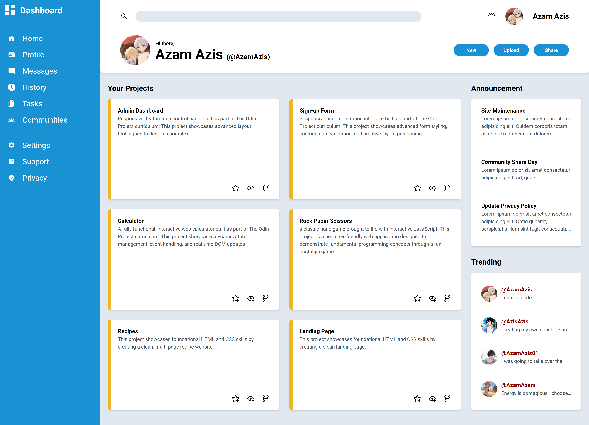
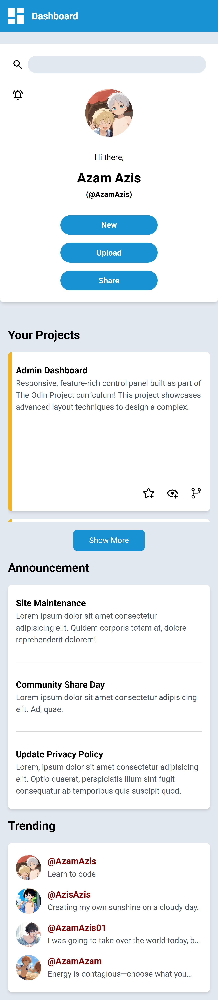

# The Odin Project - Admin Dashboard

This is a solution to the [Admin Dashboard](https://www.theodinproject.com/lessons/node-path-intermediate-html-and-css-admin-dashboard).

## Table of contents

- [The Odin Project - Admin Dashboard](#the-odin-project---admin-dashboard)
  - [Table of contents](#table-of-contents)
  - [Overview](#overview)
    - [The challenge](#the-challenge)
      - [Build a full dashboard design](#build-a-full-dashboard-design)
    - [Screenshot](#screenshot)
    - [Links](#links)
  - [My process](#my-process)
    - [Built with](#built-with)
    - [What I learned](#what-i-learned)
  - [Author](#author)

## Overview

### The challenge

#### Build a full dashboard design

Step 1: Set up and planning

- Set up your Git repository (refer to past projects if you need a refresher).
- Set up your HTML and CSS files with some dummy content, just to make sure you have everything linked correctly.
- Download a full-resolution copy of the project design file and get a general idea for how you’re going to need to lay things out in your HTML document.

Step 2: Layout

- Start by writing out the HTML elements for the sidebar, header and main-content containers.
- In your CSS file, apply Grid properties until you have this basic layout built.

Step 3: Nesting

- Taking it one section at a time, begin nesting child elements under the parent elements in the HTML. Remember that you can keep making grid containers within grid containers.
- In the sidebar, use more grids to lay out the navigation and branding sections.
- In the header, use more grids to lay out the search bar, user info and buttons.
- For the main-content, use more grids to lay out the projects, announcements and trending items.
- Fill out some dummy content and placeholder images so you can position all of your grid items.

Step 4: Gather assets

- Once you have your grid layout complete you can either recreate the dashboard example above or style your own design.
- All of the icons and more can be downloaded as SVGs from Material Design Icons.
- Choose your own fonts! The design example uses Roboto, which is available with Google fonts.

Step 5: Some tips!

- When building the layout, apply background colors or borders to your containers to help you visualize your grid.
- It’s up to you whether to use pixels, fr units or both for your grid tracks.
- This project does not have to be responsive, but if you’d like to, you can expand or shrink the project cards section when resizing the browser window.
- You don’t have to make a pixel perfect match with the design example. Consider this an opportunity to practice your CSS skills with your own designs.
- Don’t forget to push your finished dashboard to GitHub. Use GitHub Pages to publish it to the world!

### Screenshot




### Links

- Live Site URL: [https://azamazis.github.io/Project_Admin-Dashboard__TheOdinProject/](https://azamazis.github.io/Project_Admin-Dashboard__TheOdinProject/)

## My process

### Built with

- Semantic HTML5 markup
- CSS custom properties
- Flexbox
- CSS Grid
- JavaScript
- Mobile-first workflow

### What I learned

- I learned to create grid. In CSS, an element is turned into a grid container with

```css
  display: grid;
  display: inline-grid;
```

- I learned to define the columns and rows of the grid with

```css
  grid-template-columns: 50px 50px;
  grid-template-rows: 100px 100px 100px;
  grid-template: 100px 100px 100px / 50px 50px;
```

- I learned to set the implicit grid tracks using

```css
  grid-auto-columns: 20px;
  grid-auto-rows: 20px;
```

- I learned to control the auto-placement in a grid using

```css
  grid-auto-flow: column;
```

- I learned to create a gap between grid rows and column using

```css
  column-gap: 10px;
  row-gap: 20px;
  gap: 20px 10px;
```

- I learned to position grid items with

```css
  grid-column-start: 1;
  grid-column-end: 3;
  grid-column: 1 / 3;

  grid-row-start: 2;
  grid-row-end: 4;
  grid-row: 2 / 4;

  grid-area: 2 / 1 / 4 / 3;
```

- I learned to map out the whole structure of a grid using

```css
  grid-template-areas:
    "a a a"
    "b b b"
    "c c c"
  ;

  .class-a {
    grid-area: a;
  }

  .class-b {
    grid-area: b;
  }

  .class-c {
    grid-area: c;
  }
```

- I learned to use `repeat()` css function

```css
  grid-template-columns: repeat(2, 50px);
```

- I learned to use fractional(`fr`) units

```css
  grid-template-columns: repeat(2, 1fr);
```

- I learned to use `min()` and `max()` css function

```css
  grid-template-columns: repeat(2, min(50px, 20%));
  grid-template-columns: repeat(2, max(50px, 1fr));
```

- I learned to use `minmax()` css function that is specifically used with grid

```css
  grid-template-columns: repeat(3, minmax(100px, 1fr));
```

- I learned to use `clamp()` css function

```css
  width: clamp(1rem, 20%, 3rem);
  grid-template-columns: repeat(3, clamp(10px, 30%, 40px));
```

- I learned to use `auto-fit` and `auto-fill`

`auto-fit` will return the highest positive integer without overflowing the grid.
`auto-fill` is going to work exactly the same way as `auto-fit`. The difference is only noticeable when there are fewer items than can fill up the entirety of the grid row once. When the grid is expanded to a size where another grid item could fit, but there aren’t any left, auto-fit will keep the grid items at their max size. Using `auto-fill`, the grid items will snap back down to their min size once the space becomes available to add another grid item, even if there isn’t one to be rendered.

- I learned to combine both flex and grid

Flexbox can make it easier to control how that content is positioned in a Flex container. If, on the other hand, you want to accurately place content on a complex layout in two-dimensions, Grid can be easier to use.

## Author

- Twitter / X - [@AzamAzis01](https://x.com/AzamAzis01)
